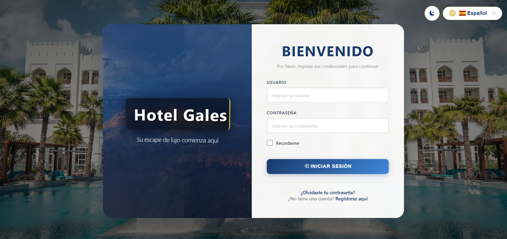
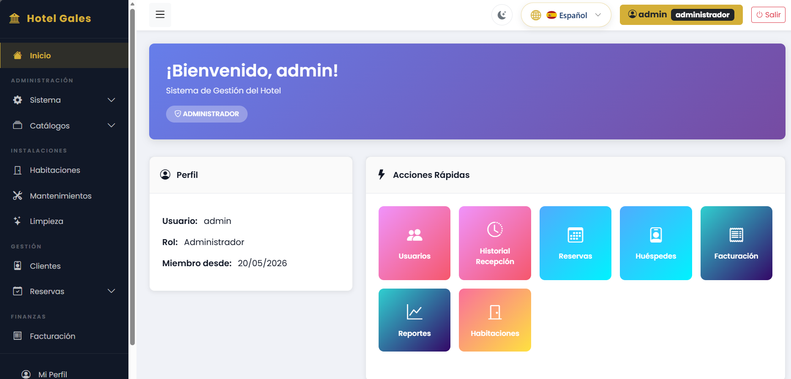
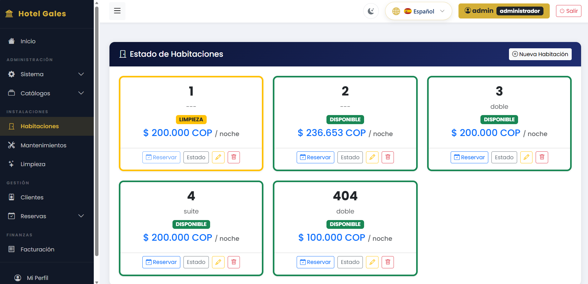
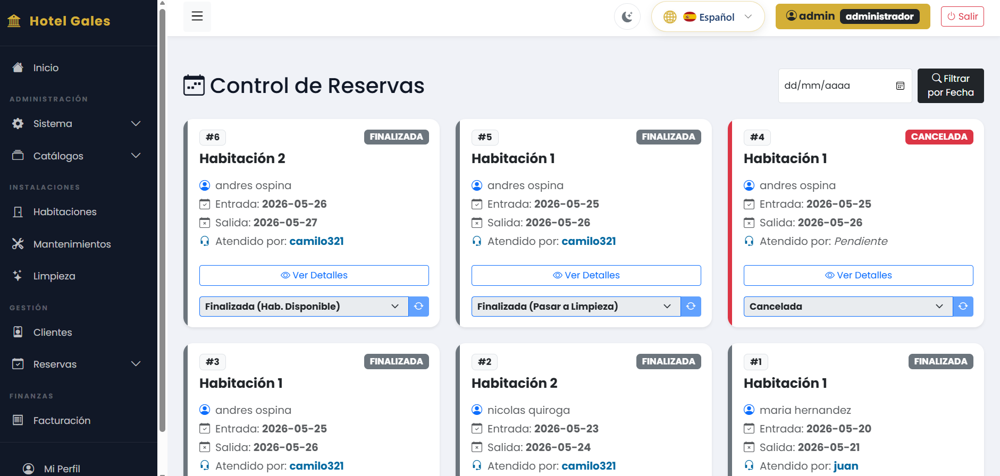
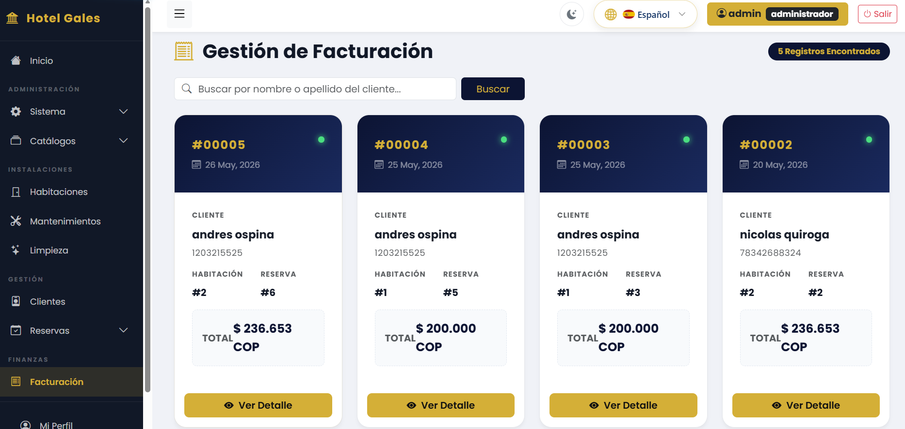
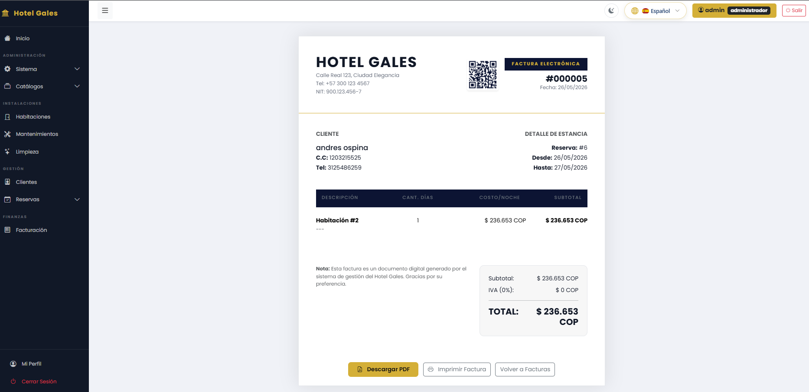
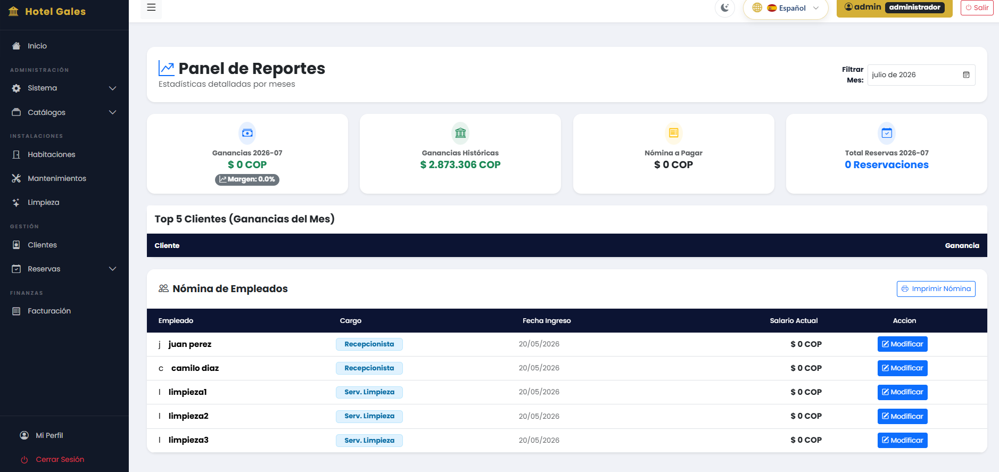
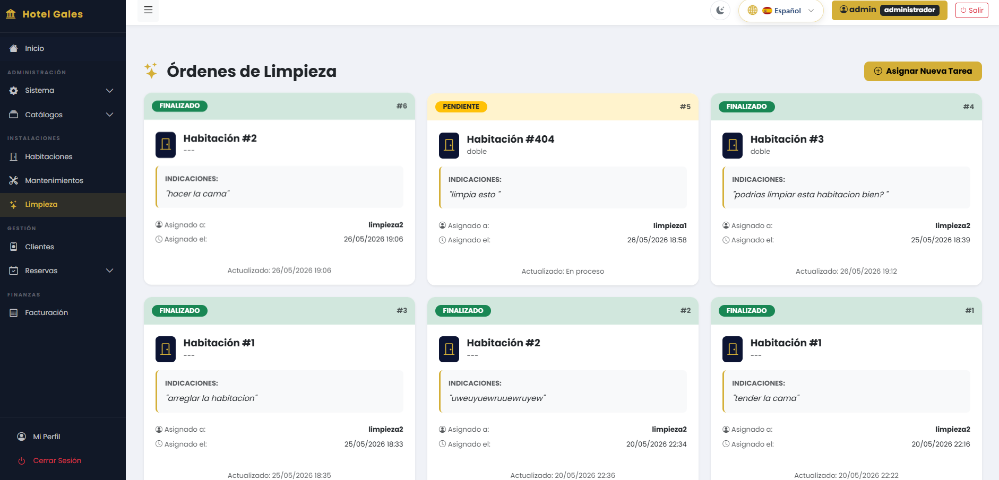

# 🏨 Hotel Gales — Hotel Management System


🌐 **Demo:** https://htg.proyecto.lol/ · 📂 **Repositorio:** https://github.com/anfeospa999-oss/hotel-management-system-web

## 📑 Índice

- [Descripción General](#-descripción-general)
- [Funcionalidades](#-funcionalidades)
- [Capturas del Sistema](#-capturas-del-sistema)
- [Tecnologías](#-tecnologías)
- [Roles y Permisos](#-roles-y-permisos)
- [Arquitectura](#-arquitectura)
- [Estructura del Proyecto](#-estructura-del-proyecto)
- [Demo en Línea](#-demo-en-línea)
- [Configuración Rápida](#-configuración-rápida)
- [Variables de Entorno](#-variables-de-entorno)
- [Equipo de Desarrollo](#-equipo-de-desarrollo)
- [Mi Participación](#-mi-participación)
- [Próximas Mejoras](#-próximas-mejoras)
- [Licencia](#-licencia)

---

## 📖 Descripción General

Sistema web de gestión hotelera desarrollado con **Flask**, **PostgreSQL** y **Docker**, diseñado para centralizar la administración de habitaciones, reservas, huéspedes, facturación, limpieza y personal mediante una arquitectura modular basada en roles.

El proyecto integra autenticación segura, reportes financieros, generación de facturas con códigos QR, internacionalización y un panel administrativo interactivo, proporcionando una solución completa para la gestión operativa de un hotel.

Este proyecto fue desarrollado de manera colaborativa durante la formación como Tecnólogos en Análisis y Desarrollo de Software (SENA), aplicando buenas prácticas de desarrollo de software, trabajo en equipo y control de versiones mediante Git y GitHub.

---

## 📊 Información del Proyecto

- 🐍 **Python 3.11+**
- 🌐 **Flask 3**
- 🗄️ **PostgreSQL**
- 🐳 **Docker**
- 📦 **17 modelos** de base de datos
- 🧩 **18 módulos** (Blueprints)
- 📄 **Más de 30 vistas**
- 👥 **4 roles** de usuario
- 🌍 **Soporte para 2 idiomas**

---

## ⚙️ Funcionalidades

### Autenticación y Usuarios
- Inicio de sesión con sesiones seguras (Flask-Login)
- Registro público de clientes en dos pasos
- Recuperación de contraseña por token
- Perfil de usuario (editar datos, cambiar contraseña, eliminar cuenta)
- Cuatro roles con permisos granulares: Administrador, Recepcionista, Cliente, Servicio de Limpieza

### Dashboard
- Panel principal con gráficos interactivos (Chart.js)
- Vista adaptada según el rol del usuario
- Accesos rápidos a las funciones más usadas

### Gestión de Habitaciones
- CRUD completo de habitaciones
- Catálogo de tipos de habitación
- Estados: disponible, ocupada, mantenimiento, limpieza
- Vista pública de habitaciones sin autenticación
- Filtros por número, tipo, precio y estado
- Detalle con comentarios y calificación promedio

### Gestión de Reservas
- Creación de reservas (clientes para sí mismos, staff para cualquier huésped)
- Máquina de estados: pendiente → confirmada → en curso → finalizada / cancelada
- Check-in y check-out con sincronización automática del estado de la habitación
- Envío a mantenimiento al finalizar
- Validación de fechas y prevención de reservas duplicadas
- Seguimiento del recepcionista que atendió cada reserva

### Gestión de Huéspedes
- Listado con buscador por nombre y apellido
- Estadísticas por cliente (reservas totales, completadas, canceladas, activas)
- Historial detallado de reservas por cliente

### Facturación y Pagos
- Generación automática de factura y pago al crear una reserva
- Código QR en cada factura para validación pública
- Página pública de validación de facturas
- Descarga de facturas en PDF
- Registro de pagos por método y fecha

### Reportes (Administrador)
- Reporte financiero mensual (ingresos totales y por cliente)
- Ingresos históricos acumulados
- Gestión de nómina y cálculo de margen de ganancia

### Gestión de Limpieza
- Asignación de tareas de limpieza al personal
- Estados: pendiente → en curso → finalizado
- Vista personal para cada trabajador
- Sincronización automática del estado de la habitación al completar

### Mantenimiento
- Órdenes de mantenimiento con costos y asignación a empleados
- Control de disponibilidad del personal de limpieza

### Notificaciones
- Notificaciones automáticas al crear o cancelar reservas
- Marcado individual o masivo como leídas
- Contador de no leídas en tiempo real (AJAX)

### Comentarios y Calificaciones
- Clientes pueden calificar y comentar habitaciones donde se hospedaron
- Escala de 1 a 5 estrellas
- Validación: solo clientes con reserva finalizada en esa habitación

### Internacionalización
- Español e inglés (Flask-Babel)
- Selector de idioma con persistencia en sesión

---

## 📸 Capturas del Sistema

| Login | Dashboard |
|-------|-----------|
|  |  |

| Habitaciones | Reservas |
|-------------|----------|
|  |  |

| Facturación | Factura |
|------------|---------|
|  |  |

| Reportes | Limpieza |
|---------|----------|
|  |  |

---

## 🛠 Tecnologías

### Backend
| Tecnología | Versión | Propósito |
|---|---|---|
| Python | 3.11+ | Lenguaje de programación |
| Flask | 3.0.0 | Framework web |
| Flask-SQLAlchemy | 3.1.1 | ORM para base de datos |
| Flask-Login | 0.6.3 | Autenticación de usuarios |
| Flask-Babel | 4.0.0 | Internacionalización |
| SQLAlchemy | 2.0.22 | Toolkit de base de datos |
| Jinja2 | 3.1.2 | Motor de plantillas |
| Werkzeug | 3.0.0 | Hashing de contraseñas |
| psycopg2-binary | 2.9.9 | Conector PostgreSQL |
| qrcode / Pillow | 7.4.2 / 10.0.1 | Generación de códigos QR |
| pytz | 2023.3 | Zonas horarias |
| python-dotenv | 1.0.0 | Variables de entorno |

### Frontend
| Tecnología | Propósito |
|---|---|
| Bootstrap 5.3 | Framework CSS (con soporte RTL) |
| Bootstrap Icons | Iconos |
| Font Awesome 6 | Iconos adicionales |
| Chart.js | Gráficos del dashboard |
| SweetAlert2 | Alertas y confirmaciones |
| NProgress | Barra de carga progresiva |
| html2pdf.js | Descarga de facturas PDF |
| html5-qrcode | Escáner de códigos QR |
| Google Fonts (Poppins) | Tipografía principal |

### Infraestructura
- **Docker** y **Docker Compose** para contenerización
- **PostgreSQL** en producción / **SQLite** en desarrollo
- Compatible con **Coolify** para despliegue

---

## 👥 Roles y Permisos

| Rol | Descripción |
|---|---|
| **Administrador** | Acceso total al sistema: usuarios, habitaciones, reservas, reportes, configuración |
| **Recepcionista** | Gestión de reservas, huéspedes, limpieza, facturación |
| **Cliente** | Consulta de habitaciones, reservas propias, comentarios, facturas |
| **Servicio de Limpieza** | Visualización y gestión de tareas de limpieza asignadas |

---

## 🏗 Arquitectura

El proyecto sigue una arquitectura basada en Flask utilizando el patrón **MVC (Modelo - Vista - Controlador)**, organizado mediante **Blueprints** para modularizar las funcionalidades del sistema.

- **Modelos:** 17 entidades SQLAlchemy que representan la lógica de negocio (usuarios, habitaciones, reservas, facturas, pagos, etc.)
- **Vistas:** Plantillas Jinja2 con Bootstrap 5.3, organizadas en carpetas por módulo
- **Controladores:** 18 blueprints que agrupan rutas por funcionalidad

La aplicación utiliza **PostgreSQL** como base de datos principal y **SQLAlchemy** como ORM para la gestión de los datos, con soporte para **SQLite** en entornos de desarrollo.

---

## 📁 Estructura del Proyecto

```
├── app/
│   ├── models/          # Modelos SQLAlchemy (17 entidades)
│   ├── routes/          # Blueprints con controladores (18 módulos)
│   ├── templates/       # Plantillas Jinja2 (30+ vistas)
│   ├── static/          # CSS, JS, Bootstrap, iconos
│   └── utils/           # Decoradores y definiciones de roles/permisos
├── config.py            # Configuración de la aplicación
├── run.py               # Punto de entrada
├── docker-compose.yml   # Despliegue con Docker
├── Dockerfile           # Imagen Docker
└── requirements.txt     # Dependencias Python
```

---

## ⚡ Configuración Rápida

### Con Python directo

```bash
# Clonar el repositorio
git clone https://github.com/anfeospa999-oss/hotel-management-system-web.git
cd hotel-management-system-web

# Crear y activar entorno virtual
python -m venv venv
source venv/bin/activate  # Linux/Mac
# venv\Scripts\activate   # Windows

# Instalar dependencias
pip install -r requirements.txt

# Ejecutar (usa SQLite por defecto)
python run.py
```

### Con Docker

```bash
docker-compose up -d
```

La aplicación estará disponible en `http://localhost:81`.

### Credenciales

El sistema crea automáticamente un usuario administrador en el primer inicio. Las credenciales pueden configurarse mediante las variables de entorno:

| Variable | Defecto |
|---|---|
| `ADMIN_USERNAME` | `admin` |
| `ADMIN_PASSWORD` | `hotelgales#` |

**Nota:** Se recomienda cambiar la contraseña por defecto en entornos de producción.

---

## 🌐 Variables de Entorno (.env)

| Variable | Defecto | Descripción |
|---|---|---|
| `DB_USER` | — | Usuario PostgreSQL |
| `DB_PASS` | — | Contraseña PostgreSQL |
| `DB_HOST` | — | Host PostgreSQL |
| `DB_PORT` | 5432 | Puerto PostgreSQL |
| `DB_NAME` | — | Nombre BD PostgreSQL |
| `SECRET_KEY` | `clave-por-defecto-insegura` | Clave secreta Flask |
| `ADMIN_USERNAME` | `admin` | Usuario admin inicial |
| `ADMIN_PASSWORD` | `hotelgales#` | Contraseña admin inicial |

---

## 👨‍💻 Equipo de Desarrollo

Este proyecto fue desarrollado de forma colaborativa durante la formación como Tecnólogos en Análisis y Desarrollo de Software (SENA). Cada integrante participó activamente en diferentes módulos del sistema utilizando Git y GitHub como herramientas de control de versiones.

- **Andrés Felipe Ospina** — [@anfeospa999-oss](https://github.com/anfeospa999-oss)
- **Diyer Diaz** — [@diyerdiaz](https://github.com/diyerdiaz)
-  **Juan Sarmiento** — [@JuanSar2107]((https://github.com/JuanSar2107))

---

## 🚀 Mi Participación

Mi participación dentro del proyecto estuvo enfocada principalmente en el desarrollo backend, mantenimiento y mejora continua del sistema.

Entre mis principales aportes se encuentran:

- Corrección de errores críticos y depuración del sistema
- Migraciones y actualización del esquema de la base de datos PostgreSQL
- Optimización del módulo de reservas
- Implementación y mejora del sistema de notificaciones
- Ajustes al panel de administración y permisos
- Corrección de errores relacionados con autenticación y usuarios
- Mejoras en la experiencia de usuario (UI/UX)
- Desarrollo colaborativo mediante Git y GitHub

---

## 🌐 Demo en Línea

Puedes probar una versión desplegada del sistema en el siguiente enlace:

🔗 **https://htg.proyecto.lol/**

> **Nota:** Si la aplicación tarda unos segundos en cargar, puede deberse al tiempo de inicio del servidor donde está alojada. Algunas funciones requieren autenticación según el rol del usuario.

---

## 🚀 Próximas Mejoras

- Integración de pasarela de pagos
- Envío de correos electrónicos automáticos
- API REST para aplicaciones móviles
- Pruebas automatizadas
- Pipeline de integración y despliegue continuo (CI/CD)
- Panel administrativo responsive para dispositivos móviles

---

## 📄 Licencia

Este proyecto fue desarrollado con fines académicos como parte del programa Tecnólogo en Análisis y Desarrollo de Software del SENA. Su código puede utilizarse como referencia educativa respetando los créditos de los autores.
