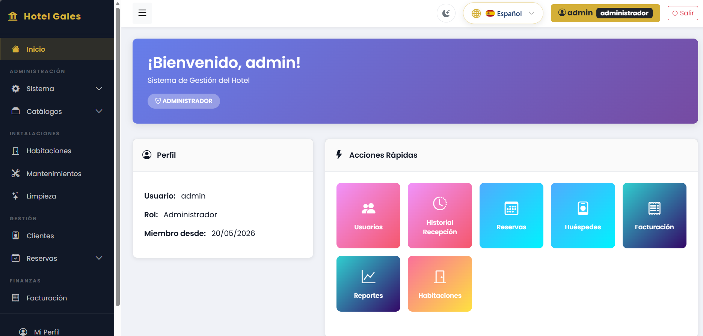
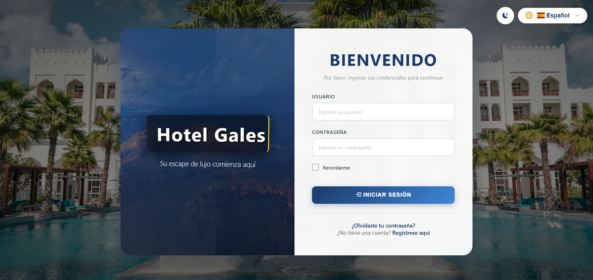
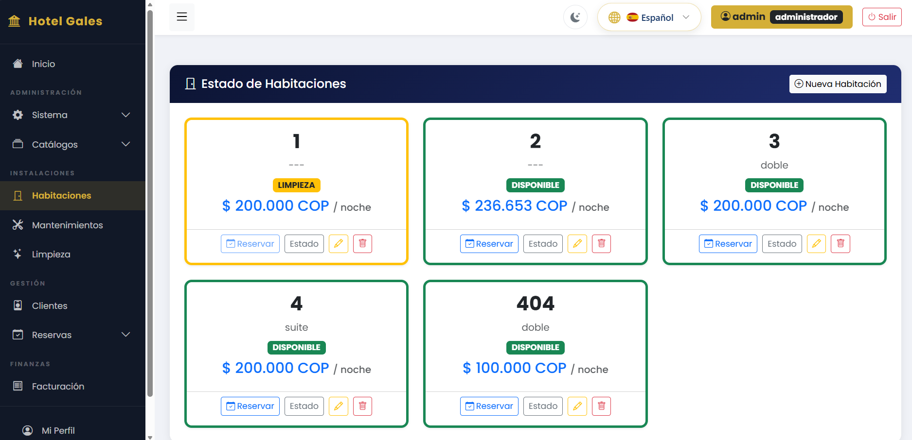
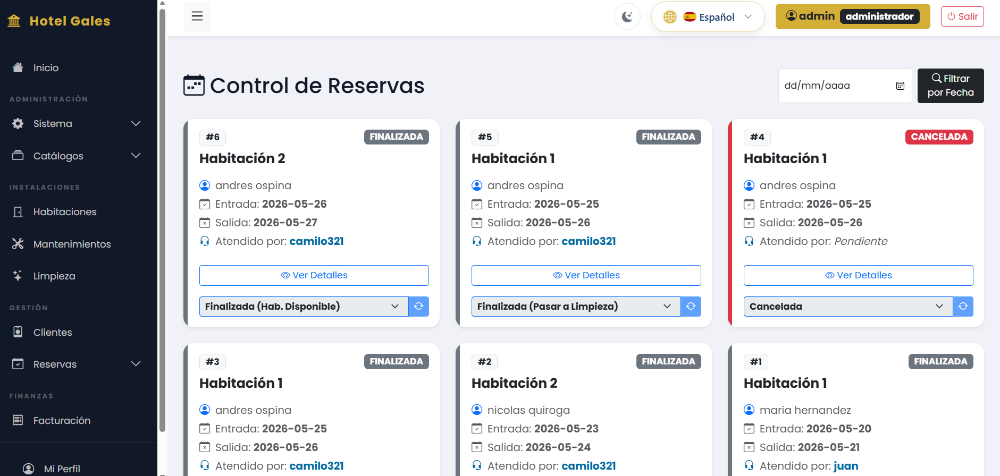
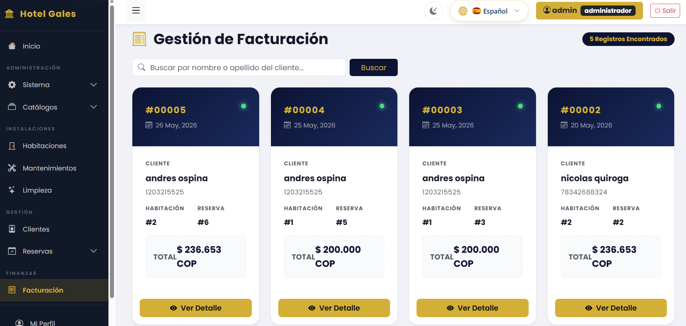
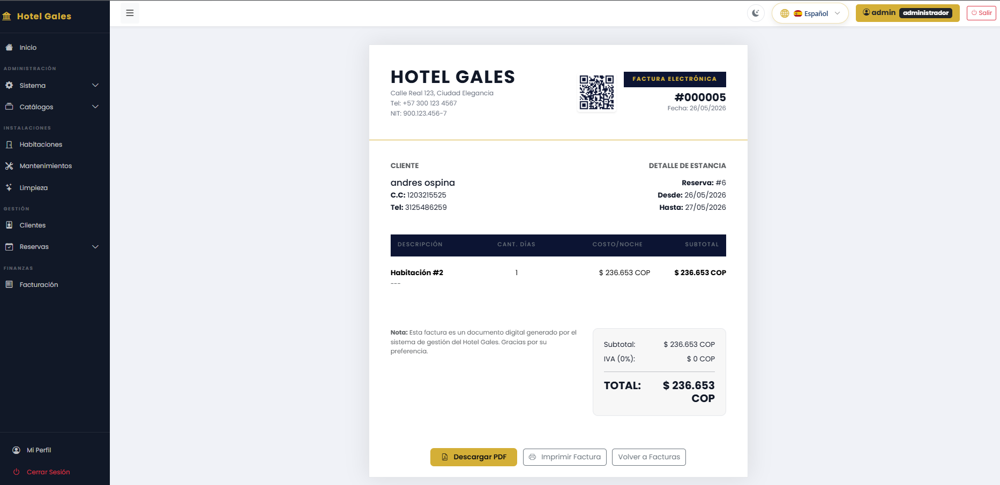
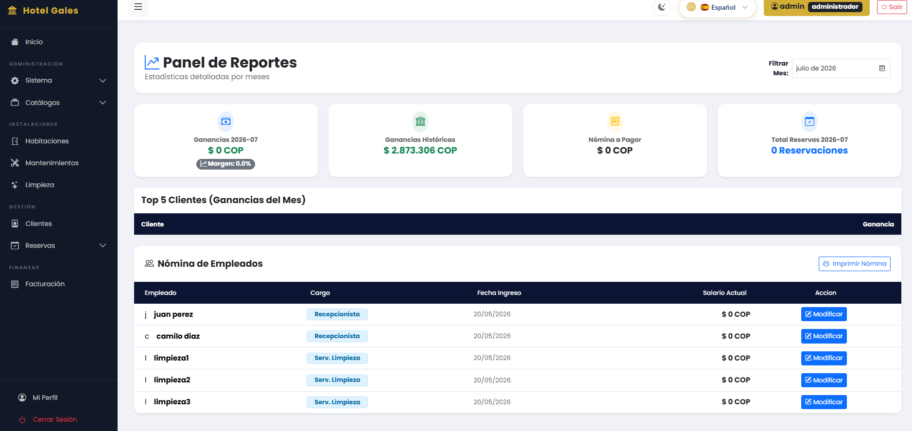
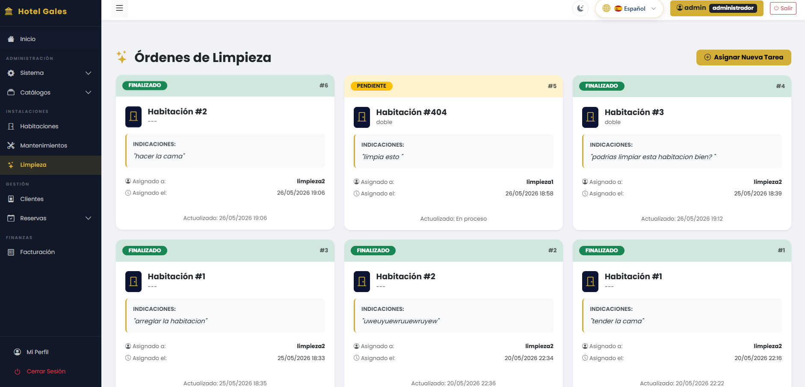

# 🏨 Hotel Gales — Sistema de Gestión Hotelera Web


> **Repositorio:** [github.com/anfeospa999-oss/hotel-management-system-web](https://github.com/anfeospa999-oss/hotel-management-system-web)

---

<div align="center">

| 🖥️ Versión de Escritorio | 🌐 Versión Web |
|:---|:---|
| **Tecnologías** | **Tecnologías** |
| • Java 24 | • Flask |
| • PostgreSQL | • PostgreSQL |
| • Swing | • Bootstrap |
| • Apache NetBeans | • HTML / CSS / JavaScript |
| **Repositorio** | **Repositorio** |
| [github.com/anfeospa999-oss/hotel-management-system-desktop](https://github.com/anfeospa999-oss/hotel-management-system-desktop) | Este repositorio |

</div>

<p align="center">
  <em>Dos plataformas. Un mismo sistema. Una sola identidad.</em>
</p>

---

## 📑 Índice

- [Descripción General](#-descripción-general)
- [Características principales](#-características-principales)
- [Información del Proyecto](#-información-del-proyecto)
- [Funcionalidades](#-funcionalidades)
- [Capturas del Sistema](#-capturas-del-sistema)
- [Tecnologías](#-tecnologías)
- [Arquitectura](#-arquitectura)
- [Estructura del Proyecto](#-estructura-del-proyecto)
- [Demo en Línea](#-demo-en-línea)
- [Configuración Rápida](#-configuración-rápida)
- [Variables de Entorno](#-variables-de-entorno)
- [Equipo de Desarrollo](#-equipo-de-desarrollo)
- [Mi Participación](#-mi-participación)
- [Estado del proyecto](#-estado-del-proyecto)
- [Próximas Mejoras](#-próximas-mejoras)
- [Licencia](#-licencia)

---

## 📖 Descripción General

**Hotel Gales** es un sistema web de gestión hotelera construido con **Flask 3.0**, **PostgreSQL 16** y **Bootstrap 5.3**, diseñado para centralizar la administración de habitaciones, reservas, huéspedes, facturación, limpieza y personal mediante una arquitectura modular basada en Blueprints y control de acceso por roles.

El sistema integra autenticación segura con Flask-Login, reportes financieros, generación de facturas con códigos QR, panel administrativo interactivo con Chart.js, internacionalización español/inglés y un sistema completo de notificaciones, proporcionando una solución integral para la gestión operativa de un hotel desde cualquier navegador.

Desarrollado como proyecto académico durante la formación en Análisis y Desarrollo de Software del **SENA**.

---

### ✨ Características principales

✔ Arquitectura MVC por Blueprints &nbsp;&nbsp;&nbsp;&nbsp; ✔ Autenticación por roles  
✔ Dashboard con gráficos Chart.js &nbsp;&nbsp;&nbsp;&nbsp; ✔ CRUD completo  
✔ Facturación con códigos QR &nbsp;&nbsp;&nbsp;&nbsp; ✔ PostgreSQL  
✔ Internacionalización ES/EN &nbsp;&nbsp;&nbsp;&nbsp; ✔ Despliegue con Docker

---

<p align="center">
  
  <br>
  <em>Panel de control principal del sistema</em>
</p>

---

## 📊 Información del Proyecto

| Ítem | Detalle |
|------|---------|
| 🐍 **Python** | 3.11+ |
| 🌐 **Flask** | 3.0.0 |
| 🗄️ **Base de Datos** | PostgreSQL 16 |
| 🐳 **Docker** | Compose + Coolify |
| 📦 **Modelos** | 17 entidades SQLAlchemy |
| 🧩 **Módulos (Blueprints)** | 18 |
| 📄 **Vistas (Templates)** | 30+ |
| 👥 **Roles de Usuario** | 4 (Administrador, Recepcionista, Cliente, Servicio de Limpieza) |
| 🌍 **Idiomas** | 2 (Español, Inglés) |

---

## ⚙️ Funcionalidades

### 🔐 Autenticación y Usuarios
- Inicio de sesión con sesiones seguras (Flask-Login)
- Registro público de clientes en dos pasos (datos personales + credenciales)
- Recuperación de contraseña por token con expiración de 1 hora
- Perfil de usuario (editar datos, cambiar contraseña, eliminar cuenta)
- **Cuatro roles** con permisos granulares: Administrador, Recepcionista, Cliente, Servicio de Limpieza

### 📊 Dashboard
- Panel principal con gráficos interactivos (Chart.js): doughnut de estados de habitaciones y barras de reservas
- Vista adaptada según el rol del usuario
- Accesos rápidos a las funciones más usadas por rol
- Cliente: reserva actual, estadísticas personales, últimas reservas y comentarios

### 🚪 Gestión de Habitaciones
- CRUD completo de habitaciones con buscador
- Catálogo de tipos de habitación (CRUD independiente)
- Estados: disponible, ocupada, mantenimiento, limpieza
- Vista pública de habitaciones sin autenticación con filtros por número, tipo, precio y estado
- Detalle de habitación con comentarios y calificación promedio

### 📅 Gestión de Reservas
- Creación de reservas (clientes para sí mismos, staff para cualquier huésped)
- Máquina de estados: pendiente → confirmada → en curso → finalizada / cancelada
- Check-in y check-out con sincronización automática del estado de la habitación
- Envío a mantenimiento al finalizar la reserva
- Validación de fechas (sin pasadas, salida > entrada) y prevención de reservas duplicadas
- Seguimiento del recepcionista que atendió cada reserva

### 👤 Gestión de Huéspedes
- Listado con buscador por nombre y apellido
- Estadísticas por cliente (reservas totales, completadas, canceladas, activas)
- Historial detallado de reservas por cliente en modal
- Ocultación automática del personal staff del listado

### 🧾 Facturación y Pagos
- Generación automática de factura y pago al crear una reserva
- Código QR en cada factura para validación pública
- Página pública de validación de facturas (sin autenticación)
- Descarga de facturas en PDF (html2pdf.js)
- Registro de pagos por método y fecha

### 📈 Reportes (Administrador)
- Reporte financiero mensual (ingresos totales y por cliente)
- Ingresos históricos acumulados
- Gestión de nómina (salarios del personal, total planilla)
- Cálculo de margen de ganancia

### 🧹 Gestión de Limpieza
- Asignación de tareas de limpieza al personal
- Estados: pendiente → en curso → finalizado
- Vista personal para cada trabajador (solo sus tareas)
- Sincronización automática del estado de la habitación: limpieza → disponible al completar
- Control de disponibilidad del personal (disponible/ocupado)

### 🔧 Mantenimiento
- Órdenes de mantenimiento con costos y asignación a empleados
- Integración con el módulo de limpieza (toggle de disponibilidad)

### 🔔 Notificaciones
- Notificaciones automáticas al crear o cancelar reservas
- Marcado individual o masivo como leídas
- Eliminación de notificaciones
- Contador de no leídas en tiempo real (AJAX)
- Enlace directo a la reserva correspondiente

### ⭐ Comentarios y Calificaciones
- Clientes pueden calificar y comentar habitaciones donde se hospedaron (1 a 5 estrellas)
- Validación: solo clientes con reserva finalizada en esa habitación
- Una reseña por habitación por cliente
- Vista de comentarios por habitación con promedio

### 🌍 Internacionalización
- Español e inglés (Flask-Babel)
- Selector de idioma con banderas y persistencia en sesión

### 🎨 Interfaz de Usuario
- Bootstrap 5.3 con soporte RTL
- Modo oscuro/claro persistente (localStorage)
- SweetAlert2 para mensajes flash y confirmaciones
- NProgress para barra de carga progresiva
- Efectos visuales: ripple, typewriter, parallax
- Sidebar responsiva con navegación por módulos

---

## 📸 Capturas del Sistema

| Pantalla | Vista |
|----------|-------|
| **Inicio de Sesión** |  |
| **Dashboard** |  |
| **Habitaciones** |  |
| **Reservas** |  |
| **Facturación** |  |
| **Factura** |  |
| **Reportes** |  |
| **Limpieza** |  |

---

## 🛠 Tecnologías

<div align="center">

| Categoría | Tecnología |
|:----------|:-----------|
| **Backend** | Python 3.11+ / Flask 3.0 |
| **Frontend** | Bootstrap 5.3 + Chart.js |
| **Base de datos** | PostgreSQL 16 |
| **ORM** | SQLAlchemy |
| **Contenerización** | Docker + Docker Compose |
| **Despliegue** | Coolify |

</div>

---

## 🏗 Arquitectura

El proyecto sigue una arquitectura basada en Flask utilizando el patrón **MVC (Modelo - Vista - Controlador)**, organizado mediante **Blueprints** para modularizar las funcionalidades del sistema.

```
┌──────────────┐     ┌──────────────┐     ┌──────────────┐
│   VISTA      │◄───►│ CONTROLADOR  │◄───►│   MODELO     │
│  (Jinja2)    │     │ (Blueprints) │     │ (SQLAlchemy) │
└──────────────┘     └──────────────┘     └──────┬───────┘
                                                  │
                                          ┌───────▼───────┐
                                          │  PostgreSQL   │
                                          └───────────────┘
```

- **Modelos** (`app/models/`): 17 entidades SQLAlchemy que representan la lógica de negocio (usuarios, habitaciones, reservas, facturas, pagos, notificaciones, comentarios, mantenimiento, limpieza, etc.).
- **Vistas** (`app/templates/`): Plantillas Jinja2 con Bootstrap 5.3, organizadas en carpetas por módulo (auth, clientes, habitaciones, reservas, facturas, dashboard, etc.).
- **Controladores** (`app/routes/`): 18 blueprints que agrupan rutas por funcionalidad con decoradores de autorización por roles y permisos.

La aplicación utiliza **PostgreSQL** como base de datos principal y **SQLAlchemy** como ORM para la gestión de los datos, con soporte para **SQLite** en entornos de desarrollo. El control de acceso se implementa mediante decoradores personalizados (`@requiere_rol`, `@requiere_permiso`) que validan contra un diccionario de permisos por rol.

---

## 📁 Estructura del Proyecto

```
├── app/
│   ├── models/          # Modelos SQLAlchemy (17 entidades)
│   ├── routes/          # Blueprints con controladores (18 módulos)
│   ├── templates/       # Plantillas Jinja2 (30+ vistas)
│   ├── static/          # CSS, JS, Bootstrap, iconos
│   └── utils/           # Decoradores y definiciones de roles/permisos
├── scripts/             # Scripts de migración y utilidades
├── config.py            # Configuración de la aplicación
├── run.py               # Punto de entrada
├── docker-compose.yml   # Despliegue con Docker
├── Dockerfile           # Imagen Docker
└── requirements.txt     # Dependencias Python
```

---

## 🌐 Demo en Línea

Puedes probar una versión desplegada del sistema en el siguiente enlace:

🔗 **https://htg.proyecto.lol/**

> **Nota:** Si la aplicación tarda unos segundos en cargar, puede deberse al tiempo de inicio del servidor donde está alojada. Algunas funciones requieren autenticación según el rol del usuario.

---

## ⚡ Configuración Rápida

### Requisitos Previos

- **Python 3.11+** ([Descargar](https://www.python.org/downloads/))
- **PostgreSQL 16** o servidor PostgreSQL accesible (opcional, usa SQLite por defecto)
- **Docker** (opcional, para despliegue contenerizado)

### Con Python directo

```bash
# Clonar el repositorio
git clone https://github.com/anfeospa999-oss/hotel-management-system-web.git
cd hotel-management-system-web

# Crear y activar entorno virtual
python -m venv venv
source venv/bin/activate  # Linux/Mac
# venv\Scripts\activate   # Windows

# Instalar dependencias
pip install -r requirements.txt

# Ejecutar (usa SQLite por defecto)
python run.py
```

### Con Docker

```bash
docker-compose up -d
```

La aplicación estará disponible en `http://localhost:81`.

### Credenciales

El sistema crea automáticamente un usuario administrador en el primer inicio. Las credenciales pueden configurarse mediante las variables de entorno:

| Variable | Defecto |
|----------|---------|
| `ADMIN_USERNAME` | `admin` |
| `ADMIN_PASSWORD` | `hotelgales#` |

> **Nota:** Se recomienda cambiar la contraseña por defecto en entornos de producción.

---

## 🌐 Variables de Entorno (.env)

| Variable | Defecto | Descripción |
|----------|---------|-------------|
| `DB_USER` | — | Usuario PostgreSQL |
| `DB_PASS` | — | Contraseña PostgreSQL |
| `DB_HOST` | — | Host PostgreSQL |
| `DB_PORT` | 5432 | Puerto PostgreSQL |
| `DB_NAME` | — | Nombre BD PostgreSQL |
| `SECRET_KEY` | `clave-por-defecto-insegura` | Clave secreta Flask |
| `ADMIN_USERNAME` | `admin` | Usuario admin inicial |
| `ADMIN_PASSWORD` | `hotelgales#` | Contraseña admin inicial |

---

## 👨‍💻 Equipo de Desarrollo

Proyecto desarrollado como parte del programa de formación del **SENA** (Servicio Nacional de Aprendizaje) — Análisis y Desarrollo de Software.

| Integrante | Rol | Contribuciones |
|-----------|-----|---------------|
| **Andrés Felipe Ospina** | Desarrollador | Corrección de errores, migraciones BD, optimización de reservas, notificaciones, panel de administración, autenticación, UI/UX |
| **Diyer Diaz** | Desarrollador | Desarrollo principal, módulos core, infraestructura, despliegue |
| **Juan Sarmiento** | Desarrollador | — |

---

## 🚀 Mi Participación (Andrés Felipe Ospina)

Como parte del equipo de desarrollo, mis contribuciones se enfocaron en el desarrollo backend, mantenimiento y mejora continua del sistema:

### Desarrollo Backend
- Corrección de errores críticos y depuración del sistema
- Migraciones y actualización del esquema de la base de datos PostgreSQL
- Optimización del módulo de reservas con validaciones de fechas y estados
- Implementación y mejora del sistema de notificaciones con contador AJAX
- Corrección de errores relacionados con autenticación y usuarios

### Panel de Administración
- Ajustes al panel de administración y sistema de permisos por rol
- Ocultación de botones editar/eliminar para usuarios protegidos
- Mejoras en la gestión de roles y restricciones de acceso

### Experiencia de Usuario
- Mejoras en la interfaz de usuario y experiencia de navegación
- Desarrollo colaborativo mediante Git y GitHub

---

## 🚀 Próximas Mejoras

- [ ] Integración de pasarela de pagos
- [ ] Envío de correos electrónicos automáticos
- [ ] API REST para aplicaciones móviles
- [ ] Pruebas automatizadas
- [ ] Pipeline de integración y despliegue continuo (CI/CD)
- [ ] Panel administrativo responsive para dispositivos móviles

---

## 📈 Estado del proyecto

✅ **Desarrollo activo**

✔ CRUD completos &nbsp;&nbsp;&nbsp;&nbsp; ✔ Dashboard con gráficos  
✔ Facturación con QR &nbsp;&nbsp;&nbsp;&nbsp; ✔ Internacionalización ES/EN

🚧 **Próximamente**

🔲 Pasarela de pagos &nbsp;&nbsp;&nbsp;&nbsp; 🔲 API REST  
🔲 Pruebas automatizadas &nbsp;&nbsp;&nbsp;&nbsp; 🔲 CI/CD

---

## 📄 Licencia

Este proyecto fue desarrollado con fines académicos durante la formación como Tecnólogo en Análisis y Desarrollo de Software del SENA. Puede utilizarse como referencia para fines educativos respetando los créditos de los autores.

---

<p align="center">
  <strong>Hotel Gales</strong><br>
  <sub>Sistema de Gestión Hotelera Web</sub><br><br>
  Versión web del ecosistema Hotel Gales.<br>
  Proyecto hermano de la <a href="https://github.com/anfeospa999-oss/hotel-management-system-desktop">versión de escritorio</a>.<br><br>
  Hotel Gales forma parte de un ecosistema compuesto por una<br>
  aplicación web y una aplicación de escritorio que comparten<br>
  la misma identidad visual y funcional.<br><br>
  Desarrollado con ❤️ para el SENA — Colombia 🇨🇴
</p>
