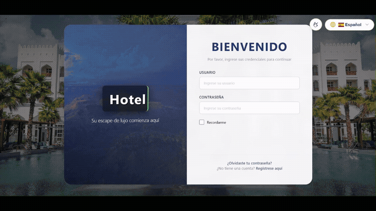

<div align="center">

# 🏨 Hotel Gales — Sistema de Gestión Hotelera Web


> **Repositorio:** [github.com/anfeospa999-oss/hotel-management-system-web](https://github.com/anfeospa999-oss/hotel-management-system-web)

---

| 🌐 Versión Web | 🖥️ Versión de Escritorio |
|:---|:---|
| **Tecnologías** | **Tecnologías** |
| • Flask | • Java 24 |
| • PostgreSQL | • PostgreSQL |
| • Bootstrap | • Swing |
| • HTML / CSS / JavaScript | • Apache NetBeans |
| **Repositorio** | **Repositorio** |
| Este repositorio | [github.com/anfeospa999-oss/hotel-management-system-desktop](https://github.com/anfeospa999-oss/hotel-management-system-desktop) |

```
                    🏨 HOTEL GALES
                          │
             ┌────────────┴────────────┐
             │                         │
        Portal Web               Desktop Java
          (Web)                   (Escritorio)
     Flask · Bootstrap ·        Java · Swing ·
     PostgreSQL                 PostgreSQL
```

*Dos plataformas. Un mismo sistema. Una sola identidad.*

</div>

---

## 📑 Índice

- [Descripción General](#-descripción-general)
- [¿Por qué este proyecto?](#-por-qué-este-proyecto)
- [Características principales](#-características-principales)
- [Demo](#-demo)
- [Información del Proyecto](#-información-del-proyecto)
- [Funcionalidades](#-funcionalidades)
- [Capturas del Sistema](#-capturas-del-sistema)
- [Tecnologías](#-tecnologías)
- [Arquitectura](#-arquitectura)
- [Estructura del Proyecto](#-estructura-del-proyecto)
- [Roadmap](#-roadmap)
- [Configuración Rápida](#-configuración-rápida)
- [Variables de Entorno](#-variables-de-entorno)
- [Equipo de Desarrollo](#-equipo-de-desarrollo)
- [Mi Participación](#-mi-participación)
- [Estado del Proyecto](#-estado-del-proyecto)
- [Próximas Mejoras](#-próximas-mejoras)
- [Licencia](#-licencia)

---

## 📖 Descripción General

**Hotel Gales** es un sistema web de gestión hotelera construido con **Flask 3.0**, **PostgreSQL 16** y **Bootstrap 5.3**, diseñado para centralizar la administración de habitaciones, reservas, huéspedes, facturación, limpieza y personal mediante una arquitectura modular basada en Blueprints y control de acceso por roles.

El sistema integra autenticación segura con Flask-Login, reportes financieros, generación de facturas con códigos QR, panel administrativo interactivo con Chart.js, internacionalización español/inglés y un sistema completo de notificaciones, proporcionando una solución integral para la gestión operativa de un hotel desde cualquier navegador.

Forma parte del ecosistema **Hotel Gales**, que incluye una [versión de escritorio](https://github.com/anfeospa999-oss/hotel-management-system-desktop) desarrollada con Java y Swing, ambas compartiendo la misma base de datos PostgreSQL y la identidad visual del hotel.

---

## 💡 ¿Por qué este proyecto?

Este sistema fue desarrollado como proyecto académico durante la formación en **Análisis y Desarrollo de Software** del **SENA**, con el objetivo de aplicar los conocimientos adquiridos en un caso de uso real: la automatización de los procesos operativos de un hotel.

**Objetivos del proyecto:**

- **Aprendizaje práctico**: Implementar una aplicación web completa utilizando Flask, PostgreSQL y Bootstrap, integrando conceptos de MVC, ORM, autenticación por roles y despliegue con Docker.
- **Arquitectura limpia**: Separar responsabilidades en modelos, vistas y controladores mediante Blueprints para facilitar el mantenimiento, la escalabilidad y la reutilización del código.
- **Trabajo colaborativo**: Utilizar Git y GitHub como herramientas de control de versiones y colaboración en equipo, incluyendo manejo de ramas, pull requests y resolución de conflictos.
- **Calidad de software**: Aplicar buenas prácticas como validación de datos, manejo de excepciones, notificaciones en tiempo real y una interfaz responsiva para mejorar la experiencia de usuario.
- **Ecosistema multiplataforma**: Demostrar la capacidad de construir un mismo sistema en dos tecnologías diferentes (web con Flask/Bootstrap y escritorio con Java/Swing), manteniendo la misma lógica de negocio y base de datos.

La experiencia adquirida abarca desde el modelado de bases de datos relacionales con SQLAlchemy hasta el diseño de interfaces modernas con Bootstrap 5.3, pasando por la implementación de internacionalización, generación de códigos QR y paneles de análisis con Chart.js.

---

## ✨ Características principales

| | |
|:---|:---|
| ✔ Arquitectura MVC por Blueprints | ✔ Autenticación por roles |
| ✔ Dashboard con gráficos Chart.js | ✔ CRUD completo |
| ✔ Facturación con códigos QR | ✔ PostgreSQL + SQLAlchemy |
| ✔ Internacionalización ES/EN | ✔ Despliegue con Docker |

---

<p align="center">
  
  <br>
  <em>Panel de control principal con estadísticas en tiempo real</em>
</p>

---

## 🎥 Demo

<p align="center">
  
</p>

> Próximamente se añadirá una demostración animada del sistema en funcionamiento.
> *Estructura preparada para reemplazar con un GIF real.*

Puedes probar el sistema en vivo en: **https://htg.proyecto.lol/**

---

## 📊 Información del Proyecto

| Ítem | Detalle |
|:-----|:--------|
| 🐍 **Lenguaje** | Python 3.11+ |
| 🌐 **Framework** | Flask 3.0.0 |
| 🗄️ **Base de Datos** | PostgreSQL 16 |
| 🐳 **Contenerización** | Docker + Docker Compose + Coolify |
| 📦 **Modelos SQLAlchemy** | 17 entidades |
| 🧩 **Blueprints** | 18 módulos |
| 📄 **Templates** | 30+ vistas |
| 👥 **Roles de usuario** | 4 (Administrador, Recepcionista, Cliente, Servicio de Limpieza) |
| 🌍 **Idiomas** | 2 (Español, Inglés) |

---

## ⚙️ Funcionalidades

### 🔐 Autenticación y Usuarios
- Inicio de sesión con sesiones seguras (Flask-Login)
- Registro público de clientes en dos pasos (datos personales + credenciales)
- Recuperación de contraseña por token con expiración de 1 hora
- Perfil de usuario (editar datos, cambiar contraseña, eliminar cuenta)
- **Cuatro roles** con permisos granulares: Administrador, Recepcionista, Cliente, Servicio de Limpieza

### 📊 Dashboard
- Panel principal con gráficos interactivos (Chart.js): doughnut de estados de habitaciones y barras de reservas
- Vista adaptada según el rol del usuario
- Accesos rápidos a las funciones más usadas por rol
- Cliente: reserva actual, estadísticas personales, últimas reservas y comentarios

### 🚪 Gestión de Habitaciones
- CRUD completo de habitaciones con buscador
- Catálogo de tipos de habitación (CRUD independiente)
- Estados: disponible, ocupada, mantenimiento, limpieza
- Vista pública de habitaciones sin autenticación con filtros por número, tipo, precio y estado
- Detalle de habitación con comentarios y calificación promedio

### 📅 Gestión de Reservas
- Creación de reservas (clientes para sí mismos, staff para cualquier huésped)
- Máquina de estados: pendiente → confirmada → en curso → finalizada / cancelada
- Check-in y check-out con sincronización automática del estado de la habitación
- Envío a mantenimiento al finalizar la reserva
- Validación de fechas (sin pasadas, salida > entrada) y prevención de reservas duplicadas
- Seguimiento del recepcionista que atendió cada reserva

### 👤 Gestión de Huéspedes
- Listado con buscador por nombre y apellido
- Estadísticas por cliente (reservas totales, completadas, canceladas, activas)
- Historial detallado de reservas por cliente en modal
- Ocultación automática del personal staff del listado

### 🧾 Facturación y Pagos
- Generación automática de factura y pago al crear una reserva
- Código QR en cada factura para validación pública
- Página pública de validación de facturas (sin autenticación)
- Descarga de facturas en PDF (html2pdf.js)
- Registro de pagos por método y fecha

### 📈 Reportes (Administrador)
- Reporte financiero mensual (ingresos totales y por cliente)
- Ingresos históricos acumulados
- Gestión de nómina (salarios del personal, total planilla)
- Cálculo de margen de ganancia

### 🧹 Gestión de Limpieza
- Asignación de tareas de limpieza al personal
- Estados: pendiente → en curso → finalizado
- Vista personal para cada trabajador (solo sus tareas)
- Sincronización automática del estado de la habitación: limpieza → disponible al completar
- Control de disponibilidad del personal (disponible/ocupado)

### 🔧 Mantenimiento
- Órdenes de mantenimiento con costos y asignación a empleados
- Integración con el módulo de limpieza (toggle de disponibilidad)

### 🔔 Notificaciones
- Notificaciones automáticas al crear o cancelar reservas
- Marcado individual o masivo como leídas
- Eliminación de notificaciones
- Contador de no leídas en tiempo real (AJAX)
- Enlace directo a la reserva correspondiente

### ⭐ Comentarios y Calificaciones
- Clientes pueden calificar y comentar habitaciones donde se hospedaron (1 a 5 estrellas)
- Validación: solo clientes con reserva finalizada en esa habitación
- Una reseña por habitación por cliente
- Vista de comentarios por habitación con promedio

### 🌍 Internacionalización
- Español e inglés (Flask-Babel)
- Selector de idioma con banderas y persistencia en sesión

### 🎨 Interfaz de Usuario
- Bootstrap 5.3 con soporte RTL
- Modo oscuro/claro persistente (localStorage)
- SweetAlert2 para mensajes flash y confirmaciones
- NProgress para barra de carga progresiva
- Efectos visuales: ripple, typewriter, parallax
- Sidebar responsiva con navegación por módulos

---

## 📸 Capturas del Sistema

| Pantalla | Vista |
|:---------|:------|
| **Inicio de Sesión** |  |
| **Dashboard** |  |
| **Habitaciones** |  |
| **Reservas** |  |
| **Facturación** |  |
| **Factura** |  |
| **Reportes** |  |
| **Limpieza** |  |

---

## 🛠 Tecnologías

<div align="center">

| Categoría | Tecnología |
|:----------|:-----------|
| **Backend** | Python 3.11+ / Flask 3.0 |
| **Frontend** | Bootstrap 5.3 + Chart.js + SweetAlert2 |
| **Base de datos** | PostgreSQL 16 / SQLite (desarrollo) |
| **ORM** | SQLAlchemy 2.0 |
| **Autenticación** | Flask-Login + Werkzeug |
| **Internacionalización** | Flask-Babel (ES/EN) |
| **Contenerización** | Docker + Docker Compose |
| **Despliegue** | Coolify |

</div>

---

## 🏗 Arquitectura

El proyecto sigue una arquitectura basada en Flask utilizando el patrón **MVC (Modelo - Vista - Controlador)**, organizado mediante **Blueprints** para modularizar las funcionalidades del sistema.

```
                     ┌──────────────────┐
                     │   USUARIO        │
                     │  (Navegador web)  │
                     └────────┬─────────┘
                              │ Petición HTTP
                              ▼
┌─────────────────────────────────────────────────────┐
│                     VISTA                            │
│           (Jinja2 — Templates HTML)                  │
│         Renderiza datos · Captura eventos           │
└────────────────────────┬────────────────────────────┘
                         │ Llamada al controlador
                         ▼
┌─────────────────────────────────────────────────────┐
│                   CONTROLADOR                        │
│              (Blueprints — Lógica de negocio)        │
│     Valida · Orquesta · Coordina Vista y Modelo     │
└────────────────────────┬────────────────────────────┘
                         │ Consulta / modifica datos
                         ▼
┌─────────────────────────────────────────────────────┐
│                     MODELO                            │
│              (SQLAlchemy — ORM)                      │
│      17 entidades que representan la lógica de negocio│
└────────────────────────┬────────────────────────────┘
                         │
                         ▼
┌─────────────────────────────────────────────────────┐
│                   PostgreSQL 16                       │
│              (Producción) / SQLite (desarrollo)      │
└─────────────────────────────────────────────────────┘
```

### Capas del sistema

- **Modelos** (`app/models/`): 17 entidades SQLAlchemy que representan la lógica de negocio (usuarios, habitaciones, reservas, facturas, pagos, notificaciones, comentarios, mantenimiento, limpieza, etc.).

- **Controladores** (`app/routes/`): 18 blueprints que agrupan rutas por funcionalidad con decoradores de autorización por roles y permisos. Actúan como puente entre la vista y el modelo.

- **Vistas** (`app/templates/`): Plantillas Jinja2 con Bootstrap 5.3, organizadas en carpetas por módulo (auth, clientes, habitaciones, reservas, facturas, dashboard, etc.).

### Control de acceso

Se implementa mediante decoradores personalizados (`@requiere_rol`, `@requiere_permiso`) que validan contra un diccionario de permisos por rol, restringiendo el acceso a rutas según el perfil del usuario autenticado.

---

## 📁 Estructura del Proyecto

```
├── 📂 app/
│   ├── 📂 models/          # 17 modelos SQLAlchemy
│   ├── 📂 routes/          # 18 blueprints
│   ├── 📂 templates/       # 30+ vistas Jinja2
│   ├── 📂 static/          # CSS, JS, Bootstrap, iconos
│   └── 📂 utils/           # Decoradores y permisos
├── 📂 scripts/             # Migraciones y utilidades
├── 📄 config.py            # Configuración de la aplicación
├── 📄 run.py               # Punto de entrada
├── 📄 docker-compose.yml   # Despliegue con Docker
├── 📄 Dockerfile           # Imagen Docker
└── 📄 requirements.txt     # Dependencias Python
```

---

## 📈 Roadmap

| Estado | Versión | Hitos alcanzados / planificados |
|:------:|:--------|:--------------------------------|
| ✅ | **v1.0** | Login, autenticación por roles (admin, recepcionista, cliente, servicio limpieza), registro de usuarios |
| ✅ | **v1.1** | CRUD completo: habitaciones, tipos de habitación, huéspedes |
| ✅ | **v1.2** | Dashboard con gráficos Chart.js, reportes financieros, gestión de limpieza y mantenimiento |
| ✅ | **v1.3** | Facturación con códigos QR, validación pública, descarga PDF, notificaciones en tiempo real |
| ✅ | **v1.4** | Internacionalización ES/EN, comentarios y calificaciones, modo oscuro |
| 🚧 | **v1.5** | API REST para integración con aplicaciones móviles |
| 🔮 | **v2.0** | Pasarela de pagos, envío de correos automáticos |
| 🔮 | **v2.1** | Pruebas automatizadas, pipeline CI/CD |

---

## ⚡ Configuración Rápida

### Requisitos

| Recurso | Versión | Descarga |
|:--------|:--------|:---------|
| Python | 3.11 o superior | [python.org](https://www.python.org/downloads/) |
| PostgreSQL | 16 o compatible | — |
| Docker | Última estable | [docker.com](https://www.docker.com/) |

### Instalación

```bash
git clone https://github.com/anfeospa999-oss/hotel-management-system-web.git
cd hotel-management-system-web
python -m venv venv
source venv/bin/activate  # Linux/Mac
# venv\Scripts\activate   # Windows
pip install -r requirements.txt
python run.py
```

### Con Docker

```bash
docker-compose up -d
```

La aplicación estará disponible en `http://localhost:81`.

### Credenciales

El sistema crea automáticamente un usuario administrador en el primer inicio. Configurable vía entorno:

| Variable | Defecto |
|:---------|:--------|
| `ADMIN_USERNAME` | `admin` |
| `ADMIN_PASSWORD` | `hotelgales#` |

> **Nota:** Se recomienda cambiar la contraseña por defecto en entornos de producción.

---

## 🌐 Variables de Entorno (.env)

| Variable | Defecto | Descripción |
|:---------|:--------|:------------|
| `DB_USER` | — | Usuario PostgreSQL |
| `DB_PASS` | — | Contraseña PostgreSQL |
| `DB_HOST` | — | Host PostgreSQL |
| `DB_PORT` | 5432 | Puerto |
| `DB_NAME` | — | Nombre BD |
| `SECRET_KEY` | `clave-por-defecto-insegura` | Clave secreta Flask |
| `ADMIN_USERNAME` | `admin` | Admin inicial |
| `ADMIN_PASSWORD` | `hotelgales#` | Contraseña admin |

---

## 👨‍💻 Equipo de Desarrollo

Proyecto desarrollado como parte del programa de formación del **SENA** (Servicio Nacional de Aprendizaje) — Tecnólogo en Análisis y Desarrollo de Software.

| Integrante | Rol | Contribuciones principales |
|:-----------|:----|:---------------------------|
| **Andrés Felipe Ospina** | Desarrollador | Corrección de errores, migraciones BD, optimización de reservas, notificaciones, panel de administración, autenticación, UI/UX |
| **Diyer Diaz** | Desarrollador | Desarrollo principal, módulos core, infraestructura, despliegue |
| **Juan Sarmiento** | Desarrollador | — |

---

## 🚀 Mi Participación (Andrés Felipe Ospina)

Como parte del equipo de desarrollo, mis contribuciones se enfocaron en el desarrollo backend, mantenimiento y mejora continua del sistema.

### 🐍 Desarrollo Backend

- Corrección de errores críticos y depuración del sistema
- Migraciones y actualización del esquema de la base de datos PostgreSQL
- Optimización del módulo de reservas con validaciones de fechas y estados
- Implementación y mejora del sistema de notificaciones con contador AJAX
- Corrección de errores relacionados con autenticación y usuarios

### 🛠️ Panel de Administración

- Ajustes al panel de administración y sistema de permisos por rol
- Ocultación de botones editar/eliminar para usuarios protegidos
- Mejoras en la gestión de roles y restricciones de acceso

### 🎨 Experiencia de Usuario

- Mejoras en la interfaz de usuario y experiencia de navegación
- Desarrollo colaborativo mediante Git y GitHub

---

## 📈 Estado del Proyecto

```
🟢  Desarrollo activo
```

| Dimensión | Estado |
|:----------|:------:|
| Autenticación y roles | ✅ |
| CRUD completos | ✅ |
| Dashboard con gráficos | ✅ |
| Facturación con QR | ✅ |
| Internacionalización ES/EN | ✅ |
| API REST | 🚧 |
| Pasarela de pagos | 🔲 |
| Pruebas automatizadas | 🔲 |

---

## 🚀 Próximas Mejoras

- [ ] Integración de pasarela de pagos
- [ ] Envío de correos electrónicos automáticos
- [ ] API REST para aplicaciones móviles
- [ ] Pruebas automatizadas
- [ ] Pipeline de integración y despliegue continuo (CI/CD)
- [ ] Panel administrativo responsive para dispositivos móviles

---

## 📄 Licencia

Este proyecto fue desarrollado con fines académicos durante la formación como Tecnólogo en Análisis y Desarrollo de Software del SENA. Puede utilizarse como referencia para fines educativos respetando los créditos de los autores.

---

<p align="center">
  <strong>Hotel Gales</strong><br>
  <sub>Sistema de Gestión Hotelera Web</sub><br><br>
  Versión web del ecosistema Hotel Gales.<br>
  Proyecto hermano de la <a href="https://github.com/anfeospa999-oss/hotel-management-system-desktop">versión de escritorio</a>.<br><br>
  Hotel Gales forma parte de un ecosistema compuesto por una<br>
  aplicación web y una aplicación de escritorio que comparten<br>
  la misma identidad visual y funcional.<br><br>
  Desarrollado con ❤️ para el SENA — Colombia 🇨🇴
</p>
